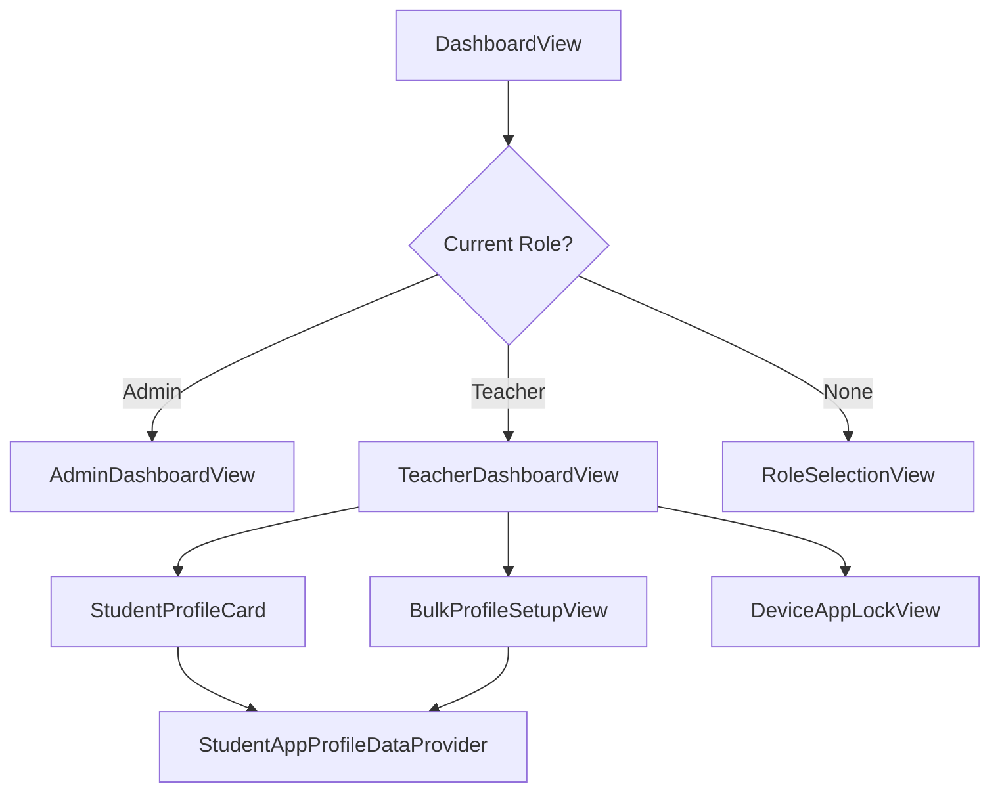
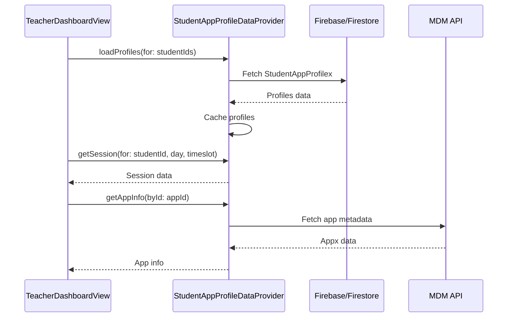

# Dashboard View Knowledge

## Overview

The dashboard system in appi4Manager is a role-based navigation structure that provides different views for **Admins** and **Teachers**. The entry point is `DashboardView.swift`, which routes users to the appropriate dashboard based on their role.

---

## Architecture



---

## Key Files

| File | Purpose |
|------|---------|
| [DashboardView.swift](file:///Users/stevenhertz/Documents/☐ Projects Good Code/◦ The Apps/apps/appi4Manager 2/appi4Manager/ContentViews/dashboard/DashboardView.swift) | Role-based router (Admin vs Teacher) |
| [AdminDashboardView.swift](file:///Users/stevenhertz/Documents/☐ Projects Good Code/◦ The Apps/apps/appi4Manager 2/appi4Manager/ContentViews/dashboard/AdminDashboardView.swift) | Admin dashboard with category tiles |
| [TeacherDashboardView.swift](file:///Users/stevenhertz/Documents/☐ Projects Good Code/◦ The Apps/apps/appi4Manager 2/appi4Manager/ContentViews/dashboard/TeacherDashboardView.swift) | Teacher dashboard with student grid |
| [StudentProfileCard.swift](file:///Users/stevenhertz/Documents/☐ Projects Good Code/◦ The Apps/apps/appi4Manager 2/appi4Manager/ContentViews/dashboard/StudentProfileCard.swift) | Student card showing app profiles |
| [BulkProfileSetupView.swift](file:///Users/stevenhertz/Documents/☐ Projects Good Code/◦ The Apps/apps/appi4Manager 2/appi4Manager/ContentViews/dashboard/BulkProfileSetupView.swift) | Bulk configuration for multiple students |

---

## DashboardView

The entry point that uses `RoleManager` to determine which dashboard to show:
- **Admin role** → `AdminDashboardView`
- **Teacher role** → `TeacherDashboardView`
- **No role** → `RoleSelectionView`

---

## AdminDashboardView

A grid-based dashboard for administrators with category tiles:

### Category Tiles
- **Devices** → `DeviceListVW`
- **Categories** → `CategoryListView`
- **Students** → `UserListDup`
- **Classes** → `SchoolListDup`
- **Apps** → `MockFromStudentScreenView`

### Environment Objects Required
- `DevicesViewModel`
- `ClassesViewModel`
- `UsersViewModel`
- `TeacherItems`

### Toolbar
- Settings gear icon → `SettingsView`

---

## TeacherDashboardView

The main dashboard for teachers showing students and their app profiles.

### View States
1. **Not Authenticated** → Login prompt
2. **Loading** → Progress indicator
3. **Error** → Error view with retry
4. **No Classes** → Empty state
5. **Multiple Classes (unselected)** → Class selection prompt
6. **Main View** → Student grid

### Key Features
- **Student Grid**: Shows students with their app profiles organized by timeslot
- **Timeslot Segmented Control**: AM (9:00-11:59), PM (12:00-4:59), Home (5:00+)
- **Day Selection**: Mon-Fri weekday selector
- **Class Switching**: Header picker for multi-class teachers

### Toolbar Buttons
| Icon | Action |
|------|--------|
| iPad | Opens devices sheet |
| Sliders | Opens bulk profile setup |
| Gear | Opens settings |

### Data Providers
- `StudentAppProfileDataProvider` - Fetches real profile data from Firebase
- Maintains separate provider for bulk setup to avoid conflicts

---

## StudentProfileCard

Displays individual student information with their app profile for a given timeslot.

### Display Elements
- Student photo with colored border (accent = has profile, gray = no profile)
- Student first and last name
- App icons (single app shows icon + name, multiple shows first icon + "+N")
- Session length bar (color-coded: green < 33%, orange < 66%, blue ≥ 66%)

### Navigation
Tapping card → `StudentProfileEditView` for individual profile editing

---

## BulkProfileSetupView

Sheet for bulk configuration of student app profiles across multiple students, days, and timeslots.

### Configuration Options
1. **Student Selection**: Horizontal scroll of avatars with checkmarks
2. **Day Selection**: Mon-Fri pills with Select All
3. **Timeslot Selection**: AM/PM/Home pills (multiple allowed)
4. **Session Duration**: Slider 5-60 minutes
5. **Category Filter**: Filter apps by type
6. **App List**: Scrollable list of selectable apps

---

## StudentAppProfileDataProvider

Firebase data provider that manages student app profiles.

### Key Methods
| Method | Purpose |
|--------|---------|
| `loadProfiles(for:)` | Batch load profiles for student IDs |
| `getSession(for:day:timeslot:)` | Get session for specific day/timeslot |
| `hasProfile(for:)` | Check if student has a profile |
| `createNewProfile(for:)` | Create default profile for student |
| `updateAndSaveSession(...)` | Update and persist session changes |

### Caching
- `profileCache`: Maps student ID to `StudentAppProfilex`
- `appCache`: Maps app ID to `Appx`
- `bundleIdToAppId`: Maps bundle ID strings to app IDs

### Timeslot Logic
```swift
static func currentTimeslot() -> TimeOfDay {
    let hour = Calendar.current.component(.hour, from: Date())
    if hour >= 9 && hour < 12 { return .am }
    else if hour >= 12 && hour < 17 { return .pm }
    else { return .home }
}
```

---

## Data Flow


